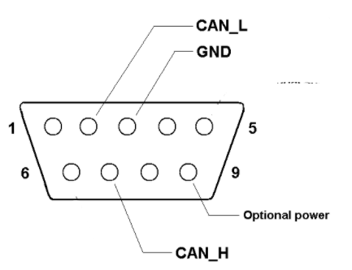
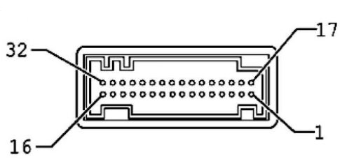
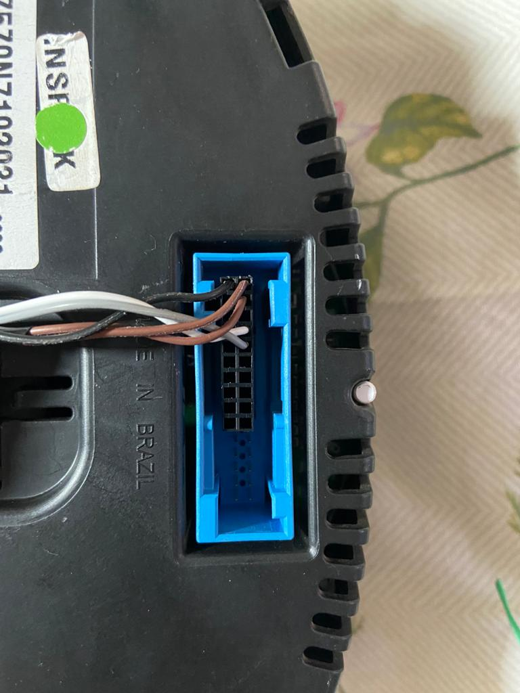
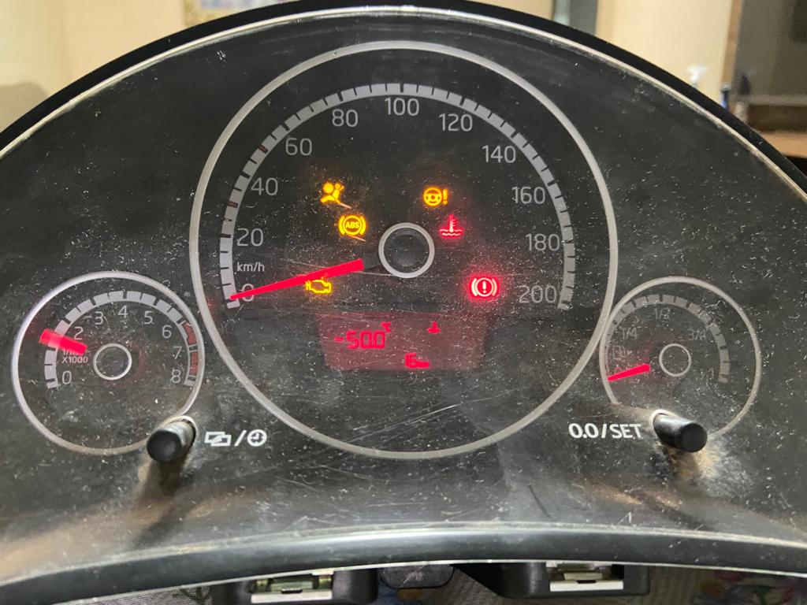
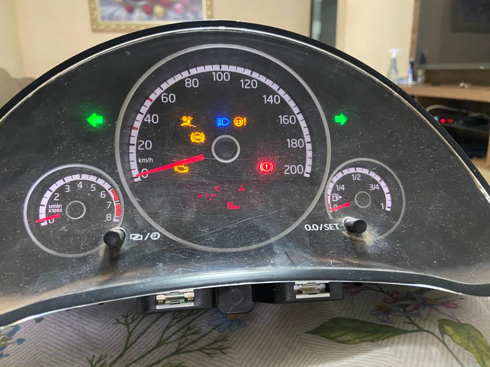
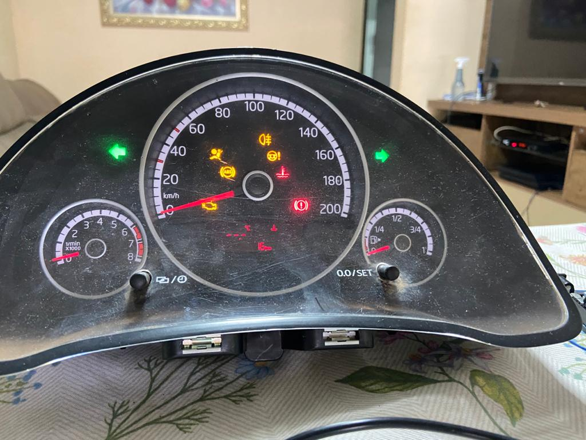

# Painel-de-controle-Up
Processo para hackear o painel de controle do Up através do barramento CAN.

# 1. Hardware
 
Para o início deste projeto foi necessário identificar as conexões e pinagens da comunicação CAN bus no painel de controle, assim como a sua devida alimentação para garantir o seu 
funcionamento. Assim, foi desmontado o painel com o intuido de identificar os transcivers para a comunicação CAN. Esse processo pode ser observado nas seguintes imagens:

 
   

As demais imagens podem ser observadas [aqui](https://github.com/Tecnomobele-FGA/Modulo-luzes/tree/master/fotos).
# 1.1 Conexões

Identificados os pinos para a comunicação CAN e a alimentação do painel, utilizou-se um conector especifico para o protocolo CAN, o `DB9`.
As pinagems dos conectores foram organizados e acoplados da seguinte forma:

  

| Pinos-DB9  | Painel | 
|:----------:|:------:|        
| 1          |    -   |         
| 2  CAN Low |   29   |        
| 3   GND    |   16   |         
| 4          |    -   |         
| 6          |    -   |    
| 7 CAN High |   28   |        
| 8          |    -   |        
| 9   12V    |  32,31 |     

Para realizar a comunicação com o painel, foi utilizado o beaglebone que já possui 2 canais CAN inclusos e possui o debian/linux como seu sistema operacional. Para mais informações de configurações do beaglebone acesse [aqui](https://github.com/Tecnomobele-FGA/Computador-de-bordo).  

# 2 Software

O sistema de comunicação CAN com o painel foi desenvolvido em `C` e foi iniciado com um código para ler e verificar se o painel esta realizando alguma comunicação CAN, como exibido na imagem:

Com pesquisas de projetos semelhantes conseguimos identificar dois endereços para testes, o `0x280` vinculado ao RPM e o `0x470` vinculado a sinalização do veículo, como setas e luz alta. Uma mensagem CAN é definida pela seguinte estrutura:  

|Endereço |            Frame              | 
|:-------:|:-----------------------------:|        
|    ID   | 1   2   3   4   5   6   7   8 |

Onde para cada endereço é enviado um frame com até 8 bytes.

Para o endereço `0x470`, o endereço de sinalização do veículo, conseguiu-se identificar os bytes 1,3 e 8.
O primeiro byte refere-se as setas em que seus valores podem variar entre 1, 2 e 3, onde 1 refere-se a seta esquerda, 2 a seta direita e 3 ambas.  
O terceiro byte é a luz de fundo do painel, podendo variar entre 0 ou 1, 0 para desligado e 1 pra ligado. 
Os resultados dos destes podem ser observados abaixo:

Já o endereço `0x280` é reservado para os dados de RPM e temperatura. Aqui ainda não ficou muito evidente como o painel consegue observar os dados que nós enviados, pois modificando alguns bytes os resultados foram os mesmos. 
